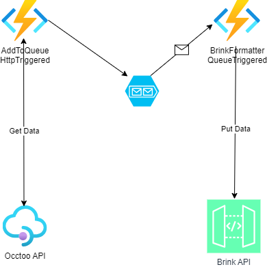

# Brink Formatter 
This project gives an example on how to create a formatter for Brink using Occtoo APIs 

**Docs:** https://docs.occtoo.com/

The solution has three function pairs working as shown below:



## Running the app
### 1. Get the code
Clone the repository and open the solution
### 2. Add a localsettings.json file and fill out the details of your project
```json
{
  "IsEncrypted": false,
  "Values": {
    "AzureWebJobsStorage": "UseDevelopmentStorage=true",
    "FUNCTIONS_WORKER_RUNTIME": "dotnet",
    "stockQueue": "localstockQueue",
    "priceQueue": "localpriceQueue",
    "productQueue": "localproductQueue",
    "OcctooTokenAuthUrl": "https://destinations.occtoo.com/destinations/%destinationId%/token",
    "ApiUrl": "",
    "StockApiUrl": "",
    "PriceApiUrl": "",
    "OcctooClientId": "",
    "OcctooClientSecret": "",

    "BrinkApiUrl": "",
    "BrinkAccessTokenClientId": "",
    "BrinkAccessTokenSecret": "",
    "BrinkTokenAuthUrl": ""
  }
}
```

### 3. Start the application
Hit F5